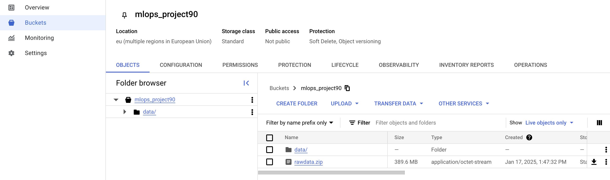

# Exam template for 02476 Machine Learning Operations

This is the report template for the exam. Please only remove the text formatted as with three dashes in front and behind
like:

```--- question 1 fill here ---```

Where you instead should add your answers. Any other changes may have unwanted consequences when your report is
auto-generated at the end of the course. For questions where you are asked to include images, start by adding the image
to the `figures` subfolder (please only use `.png`, `.jpg` or `.jpeg`) and then add the following code in your answer:

```markdown

```

In addition to this markdown file, we also provide the `report.py` script that provides two utility functions:

Running:

```bash
python report.py html
```

Will generate a `.html` page of your report. After the deadline for answering this template, we will auto-scrape
everything in this `reports` folder and then use this utility to generate a `.html` page that will be your serve
as your final hand-in.

Running

```bash
python report.py check
```

Will check your answers in this template against the constraints listed for each question e.g. is your answer too
short, too long, or have you included an image when asked. For both functions to work you mustn't rename anything.
The script has two dependencies that can be installed with

```bash
pip install typer markdown
```

## Overall project checklist

The checklist is *exhaustive* which means that it includes everything that you could do on the project included in the
curriculum in this course. Therefore, we do not expect at all that you have checked all boxes at the end of the project.
The parenthesis at the end indicates what module the bullet point is related to. Please be honest in your answers, we
will check the repositories and the code to verify your answers.

### Week 1

* [x] Create a git repository (M5)
* [x] Make sure that all team members have write access to the GitHub repository (M5)
* [x] Create a dedicated environment for you project to keep track of your packages (M2)
* [x] Create the initial file structure using cookiecutter with an appropriate template (M6)
* [x] Fill out the `data.py` file such that it downloads whatever data you need and preprocesses it (if necessary) (M6)
* [x] Add a model to `model.py` and a training procedure to `train.py` and get that running (M6)
* [x] Remember to fill out the `requirements.txt` and `requirements_dev.txt` file with whatever dependencies that you
    are using (M2+M6)
* [x] Remember to comply with good coding practices (`pep8`) while doing the project (M7)
* [ ] Do a bit of code typing and remember to document essential parts of your code (M7)
* [x] Setup version control for your data or part of your data (M8)
* [x] Add command line interfaces and project commands to your code where it makes sense (M9)
* [x] Construct one or multiple docker files for your code (M10)
* [x] Build the docker files locally and make sure they work as intended (M10)
* [x] Write one or multiple configurations files for your experiments (M11)
* [ ] Used Hydra to load the configurations and manage your hyperparameters (M11)
* [x] Use profiling to optimize your code (M12)
* [x] Use logging to log important events in your code (M14)
* [x] Use Weights & Biases to log training progress and other important metrics/artifacts in your code (M14)
* [x] Consider running a hyperparameter optimization sweep (M14)
* [ ] Use PyTorch-lightning (if applicable) to reduce the amount of boilerplate in your code (M15)

### Week 2

* [x] Write unit tests related to the data part of your code (M16)
* [x] Write unit tests related to model construction and or model training (M16)
* [x] Calculate the code coverage (M16)
* [x] Get some continuous integration running on the GitHub repository (M17)
* [x] Add caching and multi-os/python/pytorch testing to your continuous integration (M17)
* [ ] Add a linting step to your continuous integration (M17)
* [x] Add pre-commit hooks to your version control setup (M18)
* [ ] Add a continues workflow that triggers when data changes (M19)
* [ ] Add a continues workflow that triggers when changes to the model registry is made (M19)
* [x] Create a data storage in GCP Bucket for your data and link this with your data version control setup (M21)
* [x] Create a trigger workflow for automatically building your docker images (M21)
* [x] Get your model training in GCP using either the Engine or Vertex AI (M21)
* [x] Create a FastAPI application that can do inference using your model (M22)
* [x] Deploy your model in GCP using either Functions or Run as the backend (M23)
* [ ] Write API tests for your application and setup continues integration for these (M24)
* [ ] Load test your application (M24)
* [ ] Create a more specialized ML-deployment API using either ONNX or BentoML, or both (M25)
* [x] Create a frontend for your API (M26)

### Week 3

* [ ] Check how robust your model is towards data drifting (M27)
* [ ] Deploy to the cloud a drift detection API (M27)
* [ ] Instrument your API with a couple of system metrics (M28)
* [ ] Setup cloud monitoring of your instrumented application (M28)
* [ ] Create one or more alert systems in GCP to alert you if your app is not behaving correctly (M28)
* [ ] If applicable, optimize the performance of your data loading using distributed data loading (M29)
* [ ] If applicable, optimize the performance of your training pipeline by using distributed training (M30)
* [ ] Play around with quantization, compilation and pruning for you trained models to increase inference speed (M31)

### Extra

* [ ] Write some documentation for your application (M32)
* [ ] Publish the documentation to GitHub Pages (M32)
* [x] Revisit your initial project description. Did the project turn out as you wanted?
* [x] Create an architectural diagram over your MLOps pipeline
* [x] Make sure all group members have an understanding about all parts of the project
* [x] Uploaded all your code to GitHub

## Group information

### Question 1
> **Enter the group number you signed up on <learn.inside.dtu.dk>**
>
> Answer:

Group 90


### Question 2
> **Enter the study number for each member in the group**
>
> Answer:

The members in the group are:  s224388  ,s224360   and s224401


### Question 3
> **A requirement to the project is that you include a third-party package not covered in the course. What framework**
> **did you choose to work with and did it help you complete the project?**
>
> Answer:

In our project we have used Pytorch Image Models, also known as timm, as the third-party framework. This framework provides predefined and pretrained machine learning models which makes it easy to test different types of models.
In our project we have used the Resnet18 convolutional neural network with pretrained weights. This model  originally only accepts 3-color channel images but we work with PNG images which have 4 channels. This was easy to change with the argument in_chans and set that to 4. To change the output size to fit our 1000 different pokemon classes we changed the num_classes argument to 1000. Using timm made defining our model very easy as it basically became a “one-liner” that would handle all the model architecture. 

We did not spend a lot of time exploring the many different models that timm offers as we felt that creating a model with the best performance was not a main focus of this project. But we were generally quite happy with the performance that this model provided, given our fairly difficult classification task and limited data. 


## Coding environment

> In the following section we are interested in learning more about you local development environment. This includes
> how you managed dependencies, the structure of your code and how you managed code quality.

### Question 4

> **Explain how you managed dependencies in your project? Explain the process a new team member would have to go**
> **through to get an exact copy of your environment.**
>
> Answer:

We used requirement files to handle our dependencies. We downloaded packages into our own virtual environments as we developed the code and then maintained the requirements documents using the package pipreqs.
To get a requirements file copying all the packages and versions in the environment one would run "pipreqs . ",and if the file already exists you can use the command "pipreqs . --force" to overwrite the file.

We have for the most part used the command "pip freeze > requirements.txt" to update our requirements. When new additions to the code were made, the other group members would run "pip install -r requierements.txt" to get up to date with the developing environment.
To check possible conflicts in the dependencies between versions of packages we would run "pip check", and then assess what to do from there.


### Question 5

> **We expect that you initialized your project using the cookiecutter template. Explain the overall structure of your**
> **code. What did you fill out? Did you deviate from the template in some way?**
>
>
> Answer:

We have used the cookiecutter template that was provided in the beginning of the course. In this we placed our machine learning model in the src file, as well as using the folders dockerfiles, models, data and of course reports. Here we have placed files like our dockerfiles, model from our classifier data and so on.
Besides the already provided structure we added some extra folders including "app" for our deployment of the model and the folder "log" as a result of our profiling for launching TensorBoards.

Other than the folders we have produced a range of different files in the repos to help uptimize, clean up and run our code, here including .pre-commit-config.yaml, cloudbuild.yaml, my_log.log (to store logs of the code), rawdata.zip.dvc (a more optimal format to handle our data) and a few more. We did sometimes run into problems when trying to run things that were inside folders in our repository so there are some files which are not placed in folders that probably could be organized more.

From the cookiecutter template we ended up deleting the folder notebooks as we simply did not use it.


### Question 6

> **Did you implement any rules for code quality and format? What about typing and documentation? Additionally,**
> **explain with your own words why these concepts matters in larger projects.**
>
> Answer:

To check, clean up and document our code we have used the packages ruff, loguru, torch.profiler and pre-commit. We used “ruff check” to check our code for potential improvements, especially imports. If the command found any we would run “ruff check –fix” to fix them. 
The loguru package was used to do logging in our code. This included information of which operations were running in what order during training, evaluating ect and such. We used this to detect the roots of errors when they occurred as well as monitoring running code if it took a while to run.
The profiler from torch to run a TensorBoard that would tell us something about how efficient our code was running and how many calls different functions would get.
Lastly we implemented pre-commit as a way to check for improvements before committing to our repository. One would run “pre-commit run --all-files” and the code is checked for white-sapce, large files and such. 
There are many ways to improve your code, and as projects get bigger with more developers and larger repositories the importance of optimizing and good coding practices increase. This is a way to bring down running time, avoid errors and overall make further development easier.

## Version control

> In the following section we are interested in how version control was used in your project during development to
> corporate and increase the quality of your code.

### Question 7

> **How many tests did you implement and what are they testing in your code?**
>
> Answer:

We have implemented 4 tests. Primarily we are testing our model and training script as these are some of the most important parts of our project. We mainly test using dummy inputs and test if the correct shapes are outputted. We also test if the model gives the correct error messages if the inputs have the wrong shapes and sizes.
Furthermore we also make a basic test of the api, which tests if we get a http 200 response.


### Question 8

> **What is the total code coverage (in percentage) of your code? If your code had a code coverage of 100% (or close**
> **to), would you still trust it to be error free? Explain you reasoning.**
>
> Answer:

Using the Coverage library we see that we have a coverage of 50% across all of our source code. We have only written some basic tests to focus more on implementing them on Github actions. If we had a code coverage of 100% there still would be no guarantee that there would be no errors in the code. However, with 100% coverage, we would have greater confidence that there are no errors compared to our current 50% coverage.


### Question 9

> **Did you workflow include using branches and pull requests? If yes, explain how. If not, explain how branches and**
> **pull request can help improve version control.**
>
> Answer:

Our workflow did include branches, yes, but since we are all new to github it was not always that we remembered to branch out and do our separate tasks there. When we did branch out we would do our separate implementations on the branches, and then merge onto main once the task was finished. Later in the process when we got google cloud to work the unit tests really made it preferable to branch out so we could test the code alterations before merging to main with pull requests. 
One reason why we did not use branches especially in the beginning of the project, was that as we tried to get the first parts of the model up and running, even small changes needed to be pushed to main so we all could use the improvements.
For future development it definitely makes sense to branch out even in the early stages, but that is something we have learned along the way for sure.

### Question 10

> **Did you use DVC for managing data in your project? If yes, then how did it improve your project to have version**
> **control of your data. If no, explain a case where it would be beneficial to have version control of your data.**
>
> Answer:

We did make use of DVC in our project, but it did prove to be a disadvantage as we had around 26000 images of pokemon. It turns out DVC struggles when handling a lot of files and it took forever to pull down. To mitigate this we had to zip all the files and add that to DVC which made it much faster to download the data but kind of defeated the purpose of DVC as we couldn't just add new images.
We set up DVC to store our data in a google cloud bucket, which also proved useful when setting up Vertex AI so we could load data directly from the bucket.

### Question 11

> **Discuss you continuous integration setup. What kind of continuous integration are you running (unittesting,**
> **linting, etc.)? Do you test multiple operating systems, Python  version etc. Do you make use of caching? Feel free**
> **to insert a link to one of your GitHub actions workflow.**
>
> Answer:

We have organized our continuous integration into multiple steps.
First before we merge a branch into main we make use of Github actions, which installs all dependencies, loads data with DVC, preprocesses it and then runs all tests with Pytest. We only perform the tests on the latest version of the ubuntu operating system. To make this process faster we made use of caching so that Github doesn't need to install all dependencies every time. The workflow is defined in the file <https://github.com/Mariooose/mlops_group90/blob/main/.github/workflows/tests.yaml>.
Then using Google Cloud Triggers, it detects changes to the main branch on github and begins to build a new docker image with the newly published changes. When we then train the model using Vertex AI it automatically uses the newest version of the docker image. When the training is done the training configuration, data and the model is uploaded to wandb so that we can analyze the performance of the model.

In the future, we would also like to implement continuous deployment of our backend API and our frontend, as we have manually built and deployed these services whenever we updated them. But as deployment was one of the last things we worked on, we focused on just getting the backend and frontend to work and we did not go through many revisions so it was not super relevant in our case.


## Running code and tracking experiments

> In the following section we are interested in learning more about the experimental setup for running your code and
> especially the reproducibility of your experiments.

### Question 12

> **How did you configure experiments? Did you make use of config files? Explain with coding examples of how you would**
> **run a experiment.**
>
> Answer:

To configure the experiments we made use of typer to make a command line interface. That way we could change arguments without changing the code. For example to train our model with a batch size of 32, 10 epochs, a learning rate of 0,001 and push it to wand we could write
Python src/pokemon_classification/train.py --epochs 10 --lr 1e-3 --batch-size 32 --use-wandb 1.
This came in handy when using sweeps in wandb and when starting custom jobs in VertexAI.


### Question 13

> **Reproducibility of experiments are important. Related to the last question, how did you secure that no information**
> **is lost when running experiments and that your experiments are reproducible?**
>
> Answer:

To ensure that no information is lost we made use of wandb, where we logged train loss and accuracy, logged which images it trained on, plotted a histogram of the gradients and saved a ROC curve. Every run that is saved can be accessed later on.
To reproduce one would have to get the train configuration from weights and biases and then run the train script with those configurations. To be sure we start out with the same weights, we have set pretrained=True in the resnet18 model in model.py.

In general we did not perform a lot of experiments with our model. If our project were to be implemented in a more “real world” scenario we would have spent a lot more time performing experiments where we explore different model architectures, test parameters, and mix up the data to create a model with the lowest generalization error.


### Question 14

> **Upload 1 to 3 screenshots that show the experiments that you have done in W&B (or another experiment tracking**
> **service of your choice). This may include loss graphs, logged images, hyperparameter sweeps etc. You can take**
> **inspiration from [this figure](figures/wandb.png). Explain what metrics you are tracking and why they are**
> **important.**
>
> Answer:

We have used weights and biases to track and log our experiments. As seen in the first images we have tracked both the train loss and train accuracy.

which gives us an overview of how fast and accurate our experiment was. For this model in particular we had a batch size of 64, 15 epochs and with a learning rate of 0,0006. The model managed to converge towards a relatively small loss in a short amount of iterations.
A histogram of the gradients are also saved so we can see if the model is converging. 

From the image we can see that the gradients start out large, but then get smaller as the model trains. The gradients sometimes get high values but go down again indicating that the model is converging.
Weights and biases also track the system utilization so we can see how much of the memory and CPU is used throughout the training processes. Along with this the images which are used to train the model are logged in the order which they are trained upon. This way we can see exactly how the model is trained. The images are logged like this

which is from the same run as the other images.

### Question 15

> **Docker is an important tool for creating containerized applications. Explain how you used docker in your**
> **experiments/project? Include how you would run your docker images and include a link to one of your docker files.**
>
> Answer:

We have developed multiple docker images. The first, train.dockerfile, is our main dockerfile that when created can run our model. To create the image we would run the command: docker build --platform linux/amd64 -f train.dockerfile . -t train:latest  
and then 
docker run --platform linux/amd64 -it --entrypoint /bin/bash train:latest
to access the container locally. In this image we have copied essential parts of the code such as out .toml file and src/. When running this container we were able to run our classification model across both windows and mac. 
Here is a link to one of our dockerfiles (in Github): <https://github.com/Mariooose/mlops_group90/blob/main/train2.dockerfile>
Other than train we also have frontend.dockerfile and backend.dockerfile which build docker images with only the requirements for the back- and frontend of our application respectively. This made it easy to deploy our model to the cloud as once we had built the images locally and tested that they worked, it was easy to upload them to GCP artifact registry and deploy them in GCP Run.


### Question 16

> **When running into bugs while trying to run your experiments, how did you perform debugging? Additionally, did you**
> **try to profile your code or do you think it is already perfect?**
>
> Answer:

To debug our code a bunch of different approaches were used depending on the error and place in the code. Sometimes a simple print statement could help us find the issue, but other times there was a need for more advanced help. With logging we sometimes added extra statements to debug so we could inspect our .log file afterwards to find out where and why the code was failing. When the previous methods failed we would turn to other groups to help interpret error messages, or TA’s or ChatGPT if they couldn’t help. We did play around with profiling of our code, but we did not use it for debugging in particular as we did not find the output specifically helpful for us. That of course did not mean we thought our code was perfect.

## Working in the cloud

> In the following section we would like to know more about your experience when developing in the cloud.

### Question 17

> **List all the GCP services that you made use of in your project and shortly explain what each service does?**
>
> Answer:

In our project we made use of the following GCP Services
- bucket: bucket is used for storing data in the cloud
- cloud build: is used to automatically build and deploy your code from your repository, so you don’t have to do it manually
- triggers: is used for listening to certain events and then execute a cloud build
- Vertex ai: is used to automatically set up a VM, train our model and then shut it down again
- cloud run: is used to deploy or model so that we can actually use it
- artifact registry: Is used to store all our different docker containers
- Secret manager: is used to store secrets like API keys that shouldn't be pushed to Github


### Question 18

> **The backbone of GCP is the Compute engine. Explained how you made use of this service and what type of VMs**
> **you used?**
>
> Answer:

We did not directly use the Compute Engine but instead used Vertex AI to start a VM in the Compute engine using a docker image of our training source code saved in a cloud bucket. We then used it to train our model and automatically shut down the VM again. We used the machine type n1-highmen-2, which has 2 vCPU’s  and  7.5 GB of memory, which means that there is no GPU. This means that training our model takes a very long time. We chose this machine as it was quite cheap with a pricing of 0.11 dollars/hour.

### Question 19

> **Insert 1-2 images of your GCP bucket, such that we can see what data you have stored in it.**
> **You can take inspiration from [this figure](figures/bucket.png).**
>
> Answer:




### Question 20

> **Upload 1-2 images of your GCP artifact registry, such that we can see the different docker images that you have**
> **stored. You can take inspiration from [this figure](figures/registry.png).**
>
> Answer:


### Question 21

> **Upload 1-2 images of your GCP cloud build history, so we can see the history of the images that have been build in**
> **your project. You can take inspiration from [this figure](figures/build.png).**
>
> Answer:


### Question 22

> **Did you manage to train your model in the cloud using either the Engine or Vertex AI? If yes, explain how you did**
> **it. If not, describe why.**
>
> Answer:

We managed to train our model in the cloud using Vertex AI. We did this using the a vertex_ai_train.yaml which starts a cloud build that loads the wandb API key from cloud secrets. It then starts a custom job in Vertex AI with parameters and dockerfile specified in the yaml file. Because we managed to load the API keys we can upload all the data and final model to wand.
We chose Vertex AI so we didn't need to manually startup a VM, run the docker image and remember to shut down the VM again when the training has finished.


## Deployment

### Question 23

> **Did you manage to write an API for your model? If yes, explain how you did it and if you did anything special. If**
> **not, explain how you would do it.**
>
> Answer:

We did manage to write an API for our model where we used FastAPI. We started out by developing a stand alone API which could be interacted with and uploaded to GCP, but we have since also made a frontend for the API and thus moved the code for our API into the file app/backend.py. Our API has one main functionality: It can receive a PNG image and load one of our models, and then return probabilities and thus a prediction on which pokemon is in the image. The structure of the API follows the example scripts from M22 and M26 quite closely as these lined up with the functionality of our model and thus what we wanted from our API.

### Question 24

> **Did you manage to deploy your API, either in locally or cloud? If not, describe why. If yes, describe how and**
> **preferably how you invoke your deployed service?**
>
> Answer:

Yes, we have deployed our API in the cloud using GCP Run. This is done using a docker image which is built using a requirements file, requirements_backend.txt, and contains the backend.py script, our model.py script, and a trained model. This docker file is then pushed to an artifact registry and then deployed as a Run service. On top of this, we have also created a frontend for the API using streamlit, which is also deployed in GCP Run using a docker image. This frontend has an interface for uploading an image, and then displays the image and our model’s top 5 predictions of which pokemon it is, along with the respective probabilities, by calling the backend. To access the service for our backend directly, one can go to <https://backend-577977132099.europe-west1.run.app>, and use the /docs/ extension to access the FastAPI UI to test the functionality of uploading and image and getting a response. The frontend can be found at <https://frontend-577977132099.europe-west1.run.app>, check it out

### Question 25

> **Did you perform any unit testing and load testing of your API? If yes, explain how you did it and what results for**
> **the load testing did you get. If not, explain how you would do it.**
>
> Answer:

We did start looking into writing unit tests and load tests for our API but we only managed to write some very simple tests that do not really test the main functionality of our API. To make unit tests for the API, we looked into using the TestClient from FastAPI, but we did not manage to make a test which sends some kind of image or data to the endpoint which handles classification of pokemons. Such a test could be quite relevant in making sure that we get the right response if we send an accepted image type, and get the correct error if incorrect data was sent. 
We looked into using locust to load test our API, but again we did not manage to write a test that could simulate sending many images to the API, which would have been relevant.


### Question 26

> **Did you manage to implement monitoring of your deployed model? If yes, explain how it works. If not, explain how**
> **monitoring would help the longevity of your application.**
>
> Answer:

We did not implement any monitoring besides the data that is provided by the GCP Run services. We did not feel that monitoring was a top priority for our project, but if our application was to be deployed “for real” then it would be very relevant to monitor the behavior over time. In our simple testing and usage of the application it generally felt stable, but the frontend application does sometimes timeout when the first image is uploaded after opening the webpage, and this is something that could have been relevant to investigate further using load tests and monitoring.

## Overall discussion of project

> In the following section we would like you to think about the general structure of your project.

### Question 27

> **How many credits did you end up using during the project and what service was most expensive? In general what do**
> **you think about working in the cloud?**
>
> Answer:

At time of writing we have spent around 10 dollars on our project in Google cloud, under which we have run all the services we used during the project. The biggest consumer was Vertex AI which used 4.74 dollars, and then Cloud Storage, Compute Engine, Artifact Registry, and then others. We have generally found that it was useful to use cloud services, but many of them did take some substantial time to set up. It makes sense that these services cost money but it is a bit new for us as many services nowadays are some degree of “free”. 

### Question 28

> **Did you implement anything extra in your project that is not covered by other questions? Maybe you implemented**
> **a frontend for your API, use extra version control features, a drift detection service, a kubernetes cluster etc.**
> **If yes, explain what you did and why.**
>
> Answer:

As mentioned we did implement a frontend for our API using streamlit and then deployed to the cloud in GCP Run. 

### Question 29

> **Include a figure that describes the overall architecture of your system and what services that you make use of.**
> **You can take inspiration from [this figure](figures/overview.png). Additionally, in your own words, explain the**
> **overall steps in figure.**
>
> Answer:


Local developments are made by us, using at first locally stored data and tools like Typer, Profiler and ruff to make a command line-interface, optimize and clean up the code. When new implementations are finished and ready to merge to main, they will go through pre-commit, commit and push to github where the branch then goes through Unit tests to make sure the code functions.
The data is also stored in a GCP bucket via DVC, which makes training a model in the cloud possible. 

Triggers in GCP CloudBuild are activated when changes are pushed to main in GitHub, creating a new docker images for training and creation of our classification model. The image is then saved in GCP Artifact Registry. From here data from GCP bucket and the vertical machine (docker image) is opened in vertex AI. Here the model is trained and the experiment is logged in WandB. 

Once either a new model has been chosen, or a new version of our backend API or our frontend has been made locally using the frameworks FastAPI and streamlit, we push these changes to github where our (very simple) unit tests are run. To deploy a new version we manually build a docker image for either the backend or frontend and push these to our GCP artifact registry and then deploy these images using GCP Run. Finally, the user can interact with our deployed model by going to the website for our frontend, where the frontend service then calls the backend service whenever a user uploads an image.

### Question 30

> **Discuss the overall struggles of the project. Where did you spend most time and what did you do to overcome these**
> **challenges?**
>
> Answer:

This is all of us’ first time using almost all of the things within the course, including GitHub, so we have met a lot of challenges along the way. The two main challenges we have encountered were Dockerfiles and the Google Cloud Platform. Docker was difficult to get to know, and easy to make errors in, especially when we tried to set it up in the cloud with a trigger. We did get to appreciate the power of docker images but we spent a lot of time waiting for docker images to be built as this would often take 20+ minutes, but this also comes from the fact that we could have been better at trimming our requirements files and making specialized requirements files for different things from the start.

GCP in general has caused us some troubles, from simply trying to understand the platform, but also to trying to implement things from our local repository. A combination of using too many hours ourselves and getting a lot of help from Nicki and TA ensured that we worked out our problems in the end.

We also had challenges with trying to find a good format for our data, as we are working with 26000+ png photos of pokemons. The .dvc was not efficiently processing our data, so we opted to use a .zip.dvc format, which helped a lot with running time and efficiency. Of course everything got easier once we could run our model in the cloud with data from the cloud, but that of course took some time to get to.

Since our group worked across different OS we had to include some lines to make sure that models run on MAC could be run on Windows as well and the other way around. This was quite a simple fix, but before then it created problems across our whole project. 

Setting up the API and frontend took some time despite them both being quite simple in layout and amount of features. We were not familiar with API’s in general and also the frameworks FastAPI and streamlit so we spent a lot of time getting to know the documentation and trying things out. Once we got things working locally and had become familiar with docker it was not too bad to upload them to GCP and get it deployed in the cloud. 


### Question 31

> **State the individual contributions of each team member. This is required information from DTU, because we need to**
> **make sure all members contributed actively to the project**
>
> Answer:

Student s224360 was in charge of profiling, logging, ruff, pre-commit and other code quality things. Other than that they did much of the local docker-work as well as contributed to the implementation of docker in the cloud and maintaining the requirements files.

Student s224388 did most of the ML model and training, tests, weights & biases, versioncontrol and a good chunk of the GCP setup.

Student s224401 was in charge of all the API, front- and backend for our deployment of the model. 

Everyone has worked together to get the ML up and running, as well as helping each other with the tasks we were working on. All members have contributed equally to this report part.

